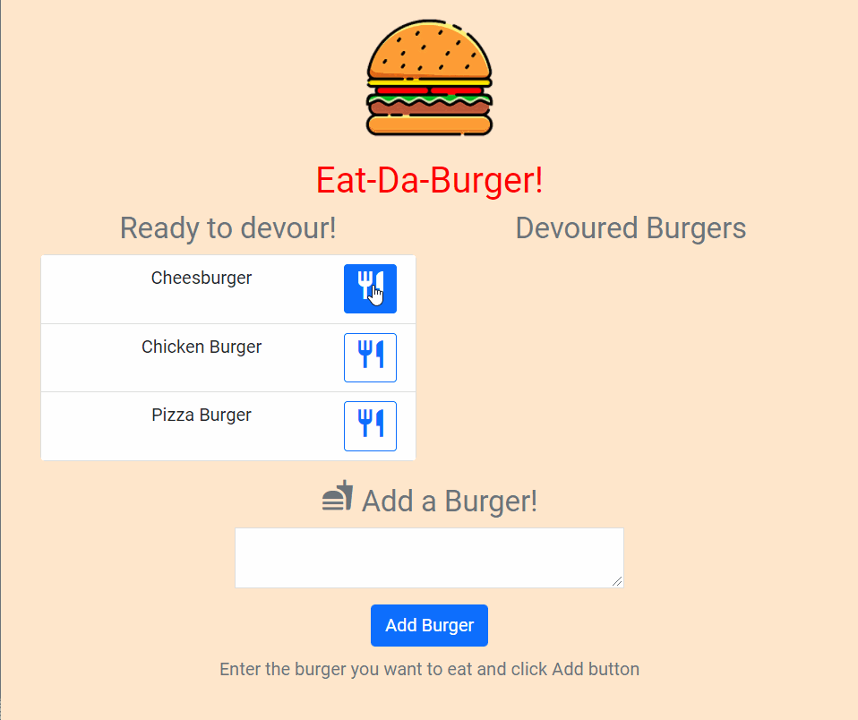

# Eat-Da Burger!     

  **Eat-Da Burger!** is a restaurant app that lets users input the names of burgers they'd like to eat. This app is a burger logger implemented  with MySQL, Node, Express, Handlebars and a homemade ORM (yum!). Codebase is following the Model View Controller (MVC) design pattern that structures it into three distinct sections according to a software design philosophy known as the _separation of concerns_. Using Node and MySQL to query and route data in the app, and Handlebars to generate page HTML.
  
## Contents

1. [Contents](#contents)
2. [Screenshot](#screenshot)
3. [Installation](#installation)
4. [Usage](#usage)
5. [License](#license)
6. [Questions](#questions)

### Screenshot

## Installation

App is deployed at [Heroku](https://heroku.com/). To install locally download files from provided Repo URL. Run terminal and navigate to project folder. Make sure node is installed. Run `npm install` to install all dependencies before running app. Run `npm start` to start app.  
Application can be accessed at [https://eat-da-burger-hbs-mvc.herokuapp.com/](https://eat-da-burger-hbs-mvc.herokuapp.com/)

## Usage

Enter name of burger you would like to eat and click on `Add` button. Whenever a user submits a burger's name, app will display the burger on the left side of the page - waiting to be devoured. Each burger in the waiting area also has a `Devour it!` button. When the user clicks on it, the burger will move to the right side of the page. App will store every burger in a database, whether devoured or not with the releavant devoured status.  
All app code is available at repository [https://github.com/elogonme/burger](https://github.com/elogonme/burger)

## License

Licensed under the 

## Questions

For any questions use contacts below:  
        :construction_worker: Developer: Eldar Humbatov  
        :email: Email: [elogon@gmail.com](mailto:elogon@gmail.com)  
        :boom: GitHub: [https://github.com/elogon](https://github.com/elogon)
  
  *Generated by [readme-generator](https://github.com/elogonme/readme-generator/)*
  